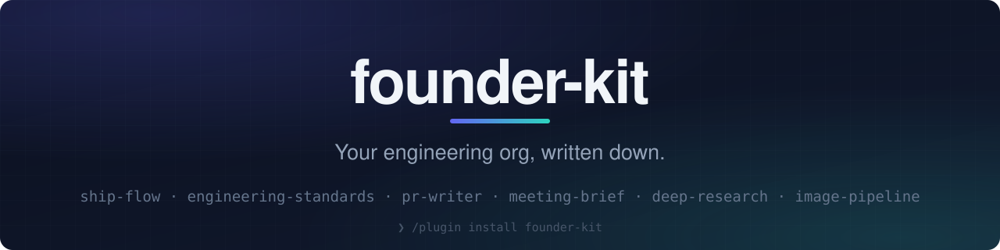
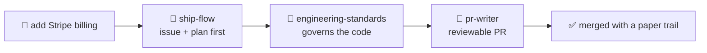

<div align="center">



<br/><br/>


<br/>


<br/><br/>

<b>Make Claude Code ship like a senior engineering team, when your whole team is you.</b>

</div>

```
/plugin marketplace add sviatil0/founder-kit
```
```
/plugin install founder-kit@founder-kit
```

Two commands typed inside a Claude Code session. No build step, no config, no dotfiles.

## ⚡ Why you need this

Claude Code out of the box is a brilliant intern. It writes code astonishingly fast, and it
ships the way an intern ships: straight to main, no issue, no plan, no tests, a PR
description that says "fixed stuff", and by next Tuesday neither of you remembers why the
schema changed.

At a real company, process catches that: a senior engineer demands a plan, a reviewer rejects
the vague PR, a rulebook says validate your inputs and never commit a secret. You do not have
those people. You have you, at 1 a.m., merging your own code.

founder-kit is those people, written down. Six skills that load into Claude and change its
default behavior: an issue and a plan before code, a rulebook it checks every change against,
PR descriptions a reviewer can trust, and real artifacts out of the unglamorous work around
building; calls become deployed follow-up pages, vague questions become cited research,
"make me a hero image" becomes a judged generation loop instead of a coin flip.

You do not learn new commands. You talk the way you already talk, and Claude behaves better.

## 🔁 What actually changes

| You say | Without founder-kit | With founder-kit |
|---|---|---|
| "add Stripe billing" | 400 lines appear on main | an issue with acceptance criteria, a plan you approve, a branch, a reviewable PR |
| "just quickly add a field" | it just quickly adds a field | the same discipline, sized down; "quickly" is how prod breaks |
| "is this safe to ship?" | a shrug in prose | checked against a 14-section rulebook: input validation, row-level security, migration safety, secrets |
| "write the PR" | "This PR makes changes to improve the app" | a body with a summary, the actual test output, and an honest checklist |
| a sales call ends | notes you never reopen | a password-locked brief on Vercel: their pains, the people involved, what was agreed, next steps |
| "should we build X?" | confident guessing | a sharpened question, sources fetched and cross-checked, a cited report with confidence levels |

## ⏱️ Your first hour

After installing, try these in your project, verbatim:

1. `let's start the next feature on my list` and watch it open an issue and write a plan
   before touching code.
2. `review this file against our standards` on the worst file you know you have.
3. Paste any meeting transcript and say `turn this into a brief I can share`.

If those three land, you have the idea. Everything below is reference.

---

## 🧰 The six skills

| | Skill | What it does | Say something like |
|---|---|---|---|
| 🚢 | `ship-flow` | Keeps every change on the issue, plan, branch, PR, merge path, sized for a tiny team. | "let's start the billing feature", "just quickly add a field", "open a PR for this" |
| 📐 | `engineering-standards` | The rulebook Claude checks code against: boundaries, zod validation, Supabase RLS, migration safety, React habits, logging, secrets, tests. | "follow the project style", "make this production grade", "is this safe to ship" |
| 📝 | `pr-writer` | PR titles and bodies that pass review and CI the first time, with honest checklists. | "write the PR", "my PR is blocked on the description", "summarize this branch" |
| 🤝 | `meeting-brief` | Turns any call transcript into a password-locked brief deployed on Vercel: pains, people, agreements, action items. | "build a brief from our call", "turn this transcript into something I can share" |
| 🔍 | `deep-research` | Sharpens a vague research request against a rubric, then fans out, verifies claims, and returns a cited report. | "research this properly", "I need a sourced report on the market", "/deep-research" |
| 🎨 | `image-pipeline` | Judged generation loop: ideas, then prompts, then images, each stage scored against your brief before the next. | "generate a hero image", "make illustrations for the landing page" |

The skills compose; that sequence is the point of the kit:



Stack assumption for the code-facing skills: Next.js App Router, TypeScript, Supabase,
Vercel. The workflow skills (ship-flow, pr-writer, deep-research, meeting-brief) do not care
what you build with.

Credentials, one line each: ship-flow, engineering-standards, and pr-writer need nothing
beyond `git` and `gh`. deep-research uses the built-in web tools. meeting-brief needs
`python3` and a logged-in Vercel CLI. image-pipeline needs `GEMINI_API_KEY`. Every skill that
depends on a credential checks for it first and prints setup instructions if it is missing.

## 🔌 How skills fire

Skills are model-invoked, not menu items. Each one ships a description saying what it does
and listing "Use when" phrases; Claude reads those descriptions and pulls in the matching
skill when your request looks like one of them. Three practical consequences:

1. **You can just talk.** "I want to add invites" is enough for ship-flow to take over.
2. **You can name one.** "Use engineering-standards on this file" or "run deep-research on
   Series A benchmarks" forces the choice when Claude guesses wrong.
3. **You can check.** `/plugin` lists what is installed and enabled. If a skill never fires,
   it is usually not installed or not enabled, not broken.

## 🧩 Recommended third-party installs

founder-kit is deliberately small. These four are what make it feel complete, and all four
come from the official Claude Code marketplace:

```
/plugin install superpowers@claude-plugins-official
/plugin install context7@claude-plugins-official
/plugin install github@claude-plugins-official
/plugin install code-review@claude-plugins-official
```

superpowers adds brainstorming, plan writing, and test-driven development skills; context7
pulls current library docs instead of letting Claude guess at an API; github gives it real
issue and PR tools; code-review gives you a second pair of eyes before you merge your own
work. Full tiered list, including the build-the-UI and power-tool sets, is in
[THIRD_PARTY.md](./THIRD_PARTY.md).

<details>
<summary><b>🕙 10-minute setup checklist</b></summary>

<br/>

Nothing below is required to install the plugin; each line unlocks one part of it.

- [ ] **Claude Code** recent enough to have `/plugin` (plugin marketplaces). If `/plugin` is
      not a command, update Claude Code first.
- [ ] **git + GitHub CLI**: `gh auth login`, then `gh repo view` inside your repo. ship-flow
      and pr-writer drive `gh` for issues and PRs.
- [ ] **Node and a package manager**: Node 20+ and `pnpm` (or npm; adjust the template
      settings if you use npm or bun).
- [ ] **Vercel**: `npm i -g vercel && vercel login`, then `vercel link` in the project.
      meeting-brief deploys through this.
- [ ] **Supabase**: a project at supabase.com, with `SUPABASE_URL` and keys in `.env.local`.
      engineering-standards assumes row level security is on from day one.
- [ ] **python3** with `requests` available: only meeting-brief's scripts need it.
- [ ] **Optional `GEMINI_API_KEY`**: free key from https://aistudio.google.com/apikey, then
      `export GEMINI_API_KEY=...`. Only image-pipeline needs it; without it that skill prints
      setup steps and stops instead of failing in a loop.
- [ ] **Optional**: copy `templates/CLAUDE.md` and `templates/settings.json` into your repo
      (see the templates section below).

</details>

<details>
<summary><b>📄 Using the templates</b></summary>

<br/>

Two files you copy once per repo:

```bash
cp templates/CLAUDE.md ./CLAUDE.md
mkdir -p .claude && cp templates/settings.json .claude/settings.json
```

- **`CLAUDE.md`** is your project conventions file, loaded automatically in every session.
  Fill in the placeholders (stack, run commands, deploy target) and delete what does not
  apply. It also tells Claude to invoke ship-flow and engineering-standards, which is what
  makes the plugin fire without you asking.
- **`.claude/settings.json`** is a conservative permission list: read-only git and `gh`
  inspection, your package scripts, and Vercel log reads are pre-approved so you stop
  clicking "allow" on `git status`. It also denies reads of `.env` files, so a stray key does
  not get pulled into context. JSON has no comments, so the explanation lives here.

Commit both. They are project configuration, not personal settings; anything machine-specific
belongs in `.claude/settings.local.json`, which you should gitignore.

</details>

<details>
<summary><b>🔄 Updating</b></summary>

<br/>

```
/plugin update founder-kit
```

New skills and edits arrive that way. If an update looks stale, remove and re-add the
marketplace:

```
/plugin marketplace remove founder-kit
/plugin marketplace add sviatil0/founder-kit
```

</details>

<details>
<summary><b>🗂️ Repo layout</b></summary>

<br/>

```
.claude-plugin/marketplace.json   the marketplace entry Claude reads
plugins/founder-kit/              the plugin itself
  .claude-plugin/plugin.json
  skills/                         six skills, one directory each
templates/                        CLAUDE.md + settings.json to copy into your repo
THIRD_PARTY.md                    tiered ecosystem guide with exact install commands
docs/superpowers/                 design spec and implementation plan
```

</details>

## 🤲 Contributing

Issues and pull requests are welcome at https://github.com/sviatil0/founder-kit. Two rules
for skill changes: a skill's `description` must name at least three concrete phrasings a user
would actually say, and any credential must be an env var with a graceful missing-credential
branch. Skills that assume one person's machine do not merge.

## License

MIT, see [LICENSE](./LICENSE). Use it, fork it, strip out the parts you do not want.
